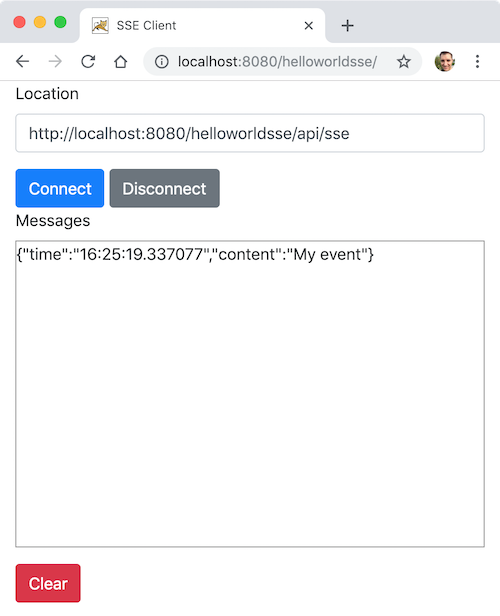

# Projet sse-helloworld-war

Cet exemple montre comment déployer une application serveur qui utilise la technologie Server-Sent Events et le langage Java avec JAX-RS et Jersey sur un serveur d'application Tomcat. Plus précisement il est expliqué comment déployer un fichier war avec un conteneur Docker basé sur une image Tomcat.

Un client HTML/JavaScript a été développé pour tester nos différentes ressources (répertoire _static/_).



## Comment compiler

- À la racine du projet, exécuter la ligne de commande suivante :

```bash
mvn clean package
```

## Comment déployer

- Exécuter la ligne de commande suivante pour télécharger l'image Docker correspondant à la version 10 de Tomcat s'exécutant sous un JRE 11

```bash
docker pull tomcat:jre11-openjdk-slim
```

- Exécuter la ligne de commande suivante permettant de créer un conteneur Docker

```bash
docker run --rm --name helloworldsse-tomcat -v $(pwd)/target/helloworldsse.war:/usr/local/tomcat/webapps/helloworldsse.war -it -p 8080:8080 tomcat:jre11-openjdk-slim
```

## Tester

- Depuis un navigateur web, saisir l'URL suivante <http://localhost:8080/helloworldsse/> sur un onglet.

- Appuyer sur **Connect**.

- Exécuter la requête suivante depuis la ligne de commande pour envoyer le contenu _My Event_ au serveur afin de créer un événement SSE qui sera transmis aux deux clients.

```bash
curl --request POST --data 'My event' http://localhost:8080/helloworldsse/api/sse
```

La sortie console attendue :

```bash
Message 'My event' has been broadcast.
```

**Résultat :** visualiser le résultat dans la zone _Messages_ de l'interface web.
