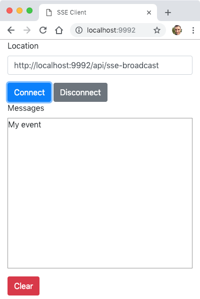

# Projet sse-helloworld

Cet exemple montre comment utiliser JAX-RS et l'implémentation Jersey pour du développement serveur avec la technologie Server-Sent Events et le langage Java.

Plus précisément trois ressources ont été développées afin d'illustrer les principales fonctionnalités du développement serveur avec SSE :

- `HelloWorldSseResource` pour envoyer un événement SSE à un client unique ;
- `HelloWorldSseBroadcastResource` pour envoyer un événement SSE à plusieurs clients (broadcast) ;
- `HelloWorldSseBroadcastWithJSONResource` pour envoyer un événement SSE à plusieurs clients (broadcast) avec des données au format JSON.

Un client HTML/JavaScript a été développé pour tester nos différentes ressources (répertoire _static/_).



Nous montrons également comment déployer ces classes comme une application Java classique par l'intermédiaire du serveur web Grizzly.

## Comment compiler

- À la racine du projet, exécuter la ligne de commande suivante :

```bash
mvn clean package
```

## Comment exécuter

- Toujours depuis la racine du projet, exécuter la ligne de commande suivante :

```bash
java -cp "target/classes:target/dependency/*" fr.mickaelbaron.helloworldserversentevents.HelloWorldServerSetEventsLauncher
```

La sortie console attendue :

```bash
mars 17, 2025 3:21:08 PM org.glassfish.grizzly.http.server.NetworkListener start
INFO: Started listener bound to [localhost:9992]
mars 17, 2025 3:21:08 PM org.glassfish.grizzly.http.server.HttpServer start
INFO: [HttpServer] Started.
Jersey app started available at http://localhost:9992/api
Hit enter to stop it...
```

## Tester

### HelloWorldSseResource

Exécuter les trois requêtes suivantes depuis la ligne de commande pour invoquer les différents résultats de la ressource `HelloWorldSseResource`.

```bash
curl http://localhost:9992/api/sse
```

La sortie console attendue :

```bash
: This is a new HelloWorld message and continue the communication.
event: add-message
id: 123
retry: 1000
data: HelloWorld
```

```bash
curl http://localhost:9992/api/sse/andstop
```

La sortie console attendue :

```bash
: This is a new HelloWorld message and terminate the communication.
event: add-message
id: 123
retry: 1000
data: HelloWorld
```

```bash
curl http://localhost:9992/api/sse/withstreaming
```

La sortie console attendue :

```bash
: This is a new HelloWorld message published each 1 second.
event: add-message
id: 0
data: HelloWorld19:08:29.426577

: This is a new HelloWorld message published each 1 second.
event: add-message
id: 1
data: HelloWorld19:08:30.436966
...
```

### HelloWorldSseBroadcastResource

- Depuis un navigateur web, saisir l'URL suivante <http://localhost:9992> sur deux onglets pour simuler la présence de deux clients.

- Saisir pour chaque onglet l'URL <http://localhost:9992/api/sse-broadcast> dans la zone _Location_.

- Appuyer sur **Connect**.

- Maintenant, exécuter la requête suivante depuis la ligne de commande pour envoyer le contenu _My Event_ au serveur afin de créer un événement SSE qui sera transmis aux deux clients.

```bash
curl --request POST --data 'My event' http://localhost:9992/api/sse-broadcast
```

La sortie console attendue :

```bash
Message 'My event' has been broadcast.
```

**Résultat :** visualiser le résultat dans la zone _Messages_ de l'interface web des deux onglets.

### HelloWorldSseBroadcastWithJSONResource

- Depuis un navigateur web, saisir l'URL suivante <http://localhost:9992> sur un onglet.

- Saisir dans la zone _Location_ l'URL suivante <http://localhost:9992/api/sse-broadcast-json>.

- Appuyer sur **Connect**.

- Exécuter la requête suivante depuis la ligne de commande pour simuler un second client.

```bash
curl http://localhost:9992/api/sse-broadcast-json
```

- Maintenant, exécuter la requête suivante depuis la ligne de commande pour envoyer le contenu _My Event_ au serveur afin de créer un événement SSE qui sera transmis aux deux clients.

```bash
curl --request POST --data 'My event' http://localhost:9992/api/sse-broadcast-json
```

La sortie console attendue :

```bash
Message 'My event' has been broadcast.
```

**Résultat :** visualiser le résultat dans la zone _Messages_ de l'interface web.

```bash
curl http://localhost:9992/api/sse-broadcast-json
```

La sortie console attendue :

```bash
: This is a new message.
event: add-message
id: 17:52:05.869907
data: {"time":"17:52:05.868505","content":"My event"}
```
